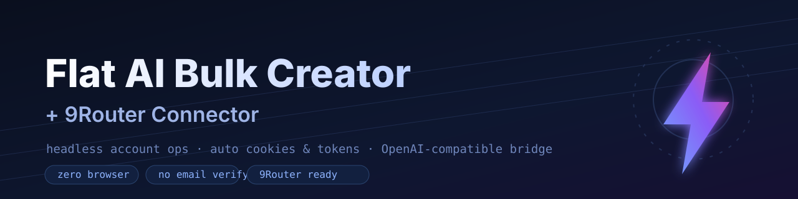

<div align="center">



# Flat AI Bulk Creator + 9Router Connector

**Crea cuentas de [Flat AI](https://flatai.org) en masa sin navegador, captura automáticamente todas las cookies de sesión y tokens, y conecta todo el grupo a [9Router](https://9router.com) como un único proveedor compatible con OpenAI.**

[](https://nodejs.org)
[](../LICENSE)
[](#-api-compatible-con-openai)
[](#-conectar-con-9router)
[](#)

[English](../README.md) · [Bahasa Indonesia](README.id.md) · **Español** · [Français](README.fr.md) · [中文](README.zh.md)

</div>

---

## ✨ Qué hace

Flat AI es un servicio WordPress + Firebase. Este kit habla directamente por HTTP — **sin navegador, sin captcha, sin verificación de correo**:

1. **Bulk-register** — crea cuentas con bandejas desechables (mail.tm).
2. **Auto-capture** — guarda las cookies de sesión de WordPress **y** el `idToken` / `refreshToken` de Firebase de cada cuenta.
3. **Bridge** — un adaptador local convierte el chat de Flat AI en un endpoint `/v1/chat/completions` compatible con OpenAI.
4. **Connect** — un solo comando conecta todo el grupo de cuentas a 9Router como un único proveedor.

## 🏗️ Arquitectura

```
┌─────────────┐      ┌───────────────┐      ┌──────────────────┐      ┌─────────────────┐
│  Tu CLI     │ ───▶ │    9Router    │ ───▶ │  provider-node   │ ───▶ │   adapter.js    │
│ / IDE / app │      │ :20128/v1     │      │  OpenAI-compat   │      │ :8788/v1 (pool) │
└─────────────┘      └───────────────┘      └──────────────────┘      └────────┬────────┘
                                                                               │ round-robin
                                                                               ▼
                                                                    ┌─────────────────────┐
                                                                    │ Cuentas Flat AI     │
                                                                    │ admin-ajax (SSE)    │
                                                                    └─────────────────────┘
```

El adaptador rota entre cuentas y cambia a la siguiente si hay error, así que 9Router solo ve un endpoint normal compatible con OpenAI.

## 📦 El kit

| Archivo | Descripción |
|---------|-------------|
| `src/register.js` | Registra **una** cuenta, captura cookies + `idToken`/`refreshToken`. También como módulo. |
| `src/bulk.js` | Creador masivo: N cuentas, concurrencia, reintentos, escribe `accounts.json`. |
| `src/verify-chat.js` | Login headless + `ChatClient` con refresco automático de nonce. |
| `src/adapter.js` | Servidor compatible con OpenAI (`/v1/chat/completions`, `/v1/models`, `/health`). |
| `src/connect-9router.js` | Inicia sesión en 9Router y crea el provider-node + connection. |

## 🚀 Inicio rápido

```bash
git clone https://github.com/0xgetz/flatai-9router-bulk.git
cd flatai-9router-bulk

# 1) Crear cuentas (escribe accounts.json)
node src/bulk.js --count 10 --concurrency 3

# 2) Ejecutar el adaptador compatible con OpenAI
PORT=8788 ACCOUNTS=accounts.json node src/adapter.js

# 3) Instalar y ejecutar 9Router
npm install -g 9router && 9router
#    ¿Instalación nueva? define INITIAL_PASSWORD=<pw> para el login remoto.

# 4) Conectar Flat AI con 9Router
node src/connect-9router.js \
  --base http://localhost:20128 \
  --password <pw-del-panel> \
  --adapter http://localhost:8788
```

### Úsalo desde cualquier cliente OpenAI

```
Base URL : http://localhost:20128/v1
API Key  : <copia del panel de 9Router>
Modelo   : flatai/account-1        # cualquier id flatai/* — el adaptador agrupa las cuentas
```

## 🔌 API compatible con OpenAI

```bash
curl http://localhost:8788/v1/chat/completions \
  -H "Content-Type: application/json" \
  -d '{"model":"flatai/account-1","messages":[{"role":"user","content":"Hola"}],"stream":false}'
```

| Endpoint | Método | Función |
|----------|--------|---------|
| `/v1/chat/completions` | POST | Chat OpenAI, streaming o JSON |
| `/v1/models` | GET | Lista de modelos `flatai/*` (uno por cuenta) |
| `/health` | GET | Estado del grupo |

## ⚙️ Configuración

| Variable | Usado por | Por defecto |
|----------|-----------|-------------|
| `PORT` | adaptador | `8788` |
| `ACCOUNTS` | adaptador | `accounts.json` |
| `FLATAI_MODE` | adaptador | `Balanced` (`Fast` / `Balanced` / `Professional`) |

### Opciones de `bulk.js`

| Opción | Por defecto | Significado |
|--------|-------------|-------------|
| `--count N` | 1 | Cuentas a crear |
| `--concurrency N` | 2 | Trabajadores paralelos |
| `--out file` | `accounts.json` | Archivo de salida (append) |
| `--name "..."` | `Flat AI User` | Nombre visible |
| `--email / --password` | — | Credenciales fijas (omite mail.tm) |
| `--connect <url>` | — | También ejecuta el conector de 9Router |

## 🔍 Cómo funciona

<details>
<summary><b>Flujo de registro</b></summary>

```
1. GET  flatai.org/register/                     -> nonce de la página
2. POST identitytoolkit signupNewUser?key=...     -> idToken + refreshToken
3. POST identitytoolkit setAccountInfo           -> nombre visible
4. POST admin-ajax.php action=flat_register_email (id_token + nonce)
                                                  -> usuario WordPress + Set-Cookie de sesión
```

</details>

<details>
<summary><b>Flujo de chat (por cuenta)</b></summary>

```
POST admin-ajax.php action=chatbot2_session              -> nonce, history_nonce, scope
POST admin-ajax.php action=chatbot2_history op=load      -> revision
POST admin-ajax.php action=chatbot2_history op=save      (values + revision)
POST admin-ajax.php action=chatbot2_route                -> modo
POST admin-ajax.php action=my_chatbot                    -> respuesta SSE
# 403 SESSION_EXPIRED -> refresca nonces y reintenta (igual que el sitio)
```

</details>

<details>
<summary><b>Integración con 9Router</b></summary>

El conector inicia sesión (`/api/auth/login`), luego `POST /api/provider-nodes` crea un nodo **openai-compatible** hacia el adaptador, y `POST /api/providers` crea la connection.

</details>

## ✅ Verificado de extremo a extremo

| Prueba | Resultado |
|--------|-----------|
| Registro headless | Cuenta creada, cookies de sesión emitidas |
| Login headless | `sign-in successful`, `member: true` |
| Chat headless | Respuesta SSE recibida |
| Adaptador OpenAI | `/v1/chat/completions` devuelve completion |
| **9Router → Flat AI** | **Petición enrutada por 9Router a una cuenta real de Flat AI y de vuelta** |

## 🧩 Requisitos

- **Node.js ≥ 18** (usa `fetch`, `FormData`, `crypto.randomUUID` globales).
- Cero dependencias npm.
- 9Router opcional — el adaptador funciona solo.

## 🔐 Seguridad y uso responsable

- `accounts.json` contiene **credenciales reales** y está ignorado por git — nunca lo subas.
- Flat AI es un servicio de terceros. Úsalo con responsabilidad, mantén baja la concurrencia y respeta sus Términos.

## 🤝 Contribuir

Issues y pull requests son bienvenidos. Mantén los cambios enfocados, sin dependencias y documentados.

## 📄 Licencia

[MIT](../LICENSE) © 2026 0xgetz

<div align="center"><sub>Sin afiliación con Flat AI ni 9Router. Creado para interoperabilidad.</sub></div>
